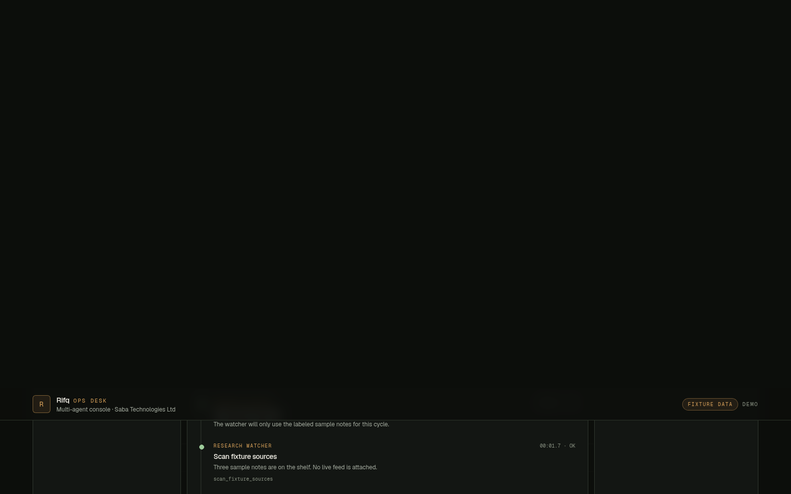
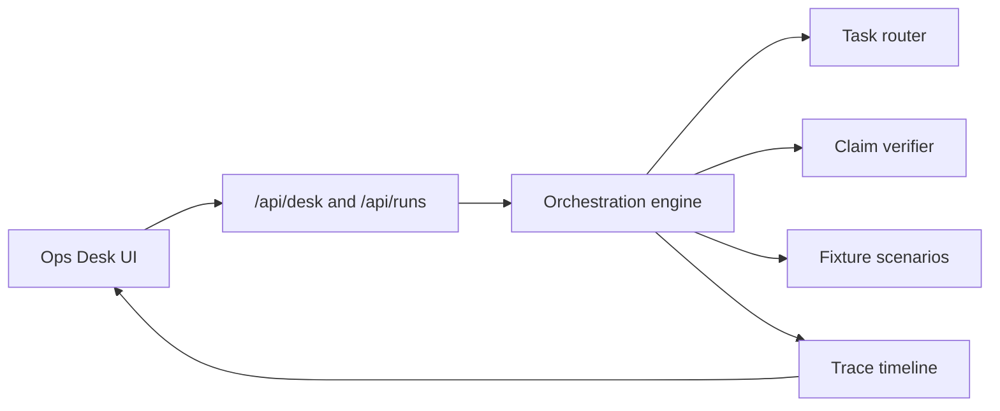
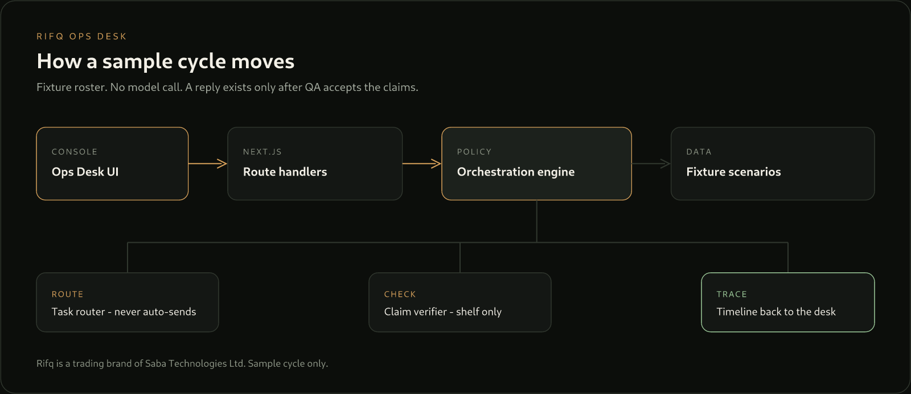

# Rifq Ops Desk

The multi-agent console our team built to rehearse research-watch and front-desk handoffs — roster, queue, tool traces, and a QA gate on one desk.

**Rifq** is a software factory and AI agency, a trading brand of **Saba Technologies Ltd**. This repository is the public Ops Desk. The happy path runs on fixture data. No API keys.



## Quickstart

```bash
npm install
npm run dev
```

Open http://localhost:3000. Choose **Corridor brief**, then **Run sample cycle**.

Finished rehearsal, no click required: http://localhost:3000/?scenario=corridor-brief&at=full

## What this demonstrates

- **Front Desk Router** classifies a sample inbound note and will not auto-send billing, scheduling, or anything else.
- **Research Watcher** drafts only from a labeled fixture shelf (`fx-note-014`, `fx-note-022`, `fx-note-031`).
- **QA Verifier** rejects an unsourced line — “All carriers have suspended the lane.” — and a reply exists only after the revision checks out.
- The timeline is the product. Every handoff and tool payload is inspectable. The sample reply is not sent.

## Stack

| | |
| --- | --- |
| Next.js 16 (App Router) | Desk UI and route handlers, one `npm run dev` |
| TypeScript | Typed agents, tasks, traces, and run plans |
| Tailwind CSS 4 | Ops-desk interface |
| Vitest | Orchestration unit tests |

## Architecture





Detail, including the fail-closed path: [docs/ARCHITECTURE.md](docs/ARCHITECTURE.md).

## Scripts

| Command | What it does |
| --- | --- |
| `npm run dev` | Desk at http://localhost:3000 |
| `npm test` | Router, verifier, and rehearsal tests |
| `npm run lint` | ESLint |
| `npm run build` | Production build |

`GET /api/desk` returns the sample roster. `POST /api/runs` with `{ "scenarioId": "corridor-brief" }` returns the plan the UI plays back. The second scenario is `front-desk-triage`.

## Demo mode

Copy `.env.example` if you want a local env file. `RIFQ_DEMO_MODE=true` documents the default. The sample cycle does not read a provider key and does not call a model. The commented `OPENAI_API_KEY` slot is unused.

## License

[MIT](LICENSE) © 2026 Saba Technologies Ltd

Maintained by the Rifq team ([@saahirmh](https://github.com/saahirmh)).
