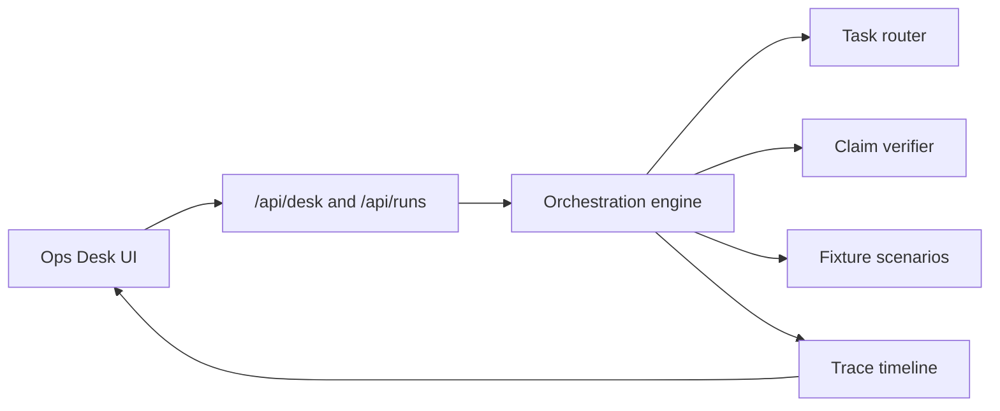
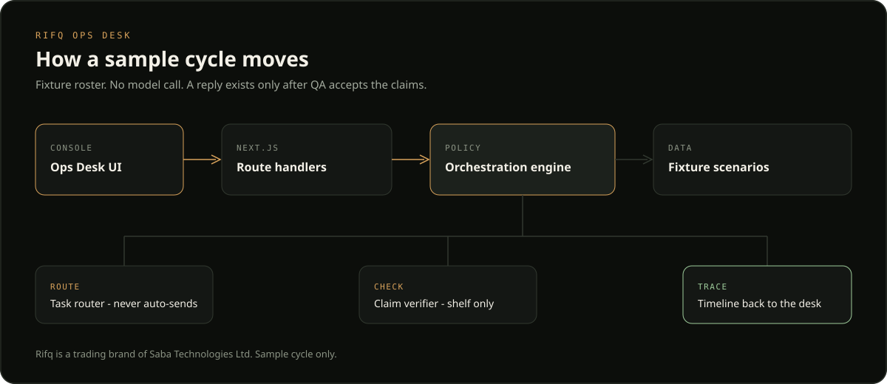

# Architecture

Rifq Ops Desk is a single Next.js app. One `npm run dev` serves the console and the route handlers. The sample cycle is a deterministic rehearsal of desk policy. It does not call a model.

## Modules

| Path | Role |
| --- | --- |
| `src/lib/orchestration/classify.ts` | Maps inbound text to research, scheduling, billing, or unclassified. Billing wins, then scheduling, then research. |
| `src/lib/orchestration/router.ts` | Chooses an agent and a queue status. `autoSend` is always false. |
| `src/lib/orchestration/verify.ts` | Rejects empty claims, missing citations, and unknown fixture source ids. Composes a reply only from approved claims. |
| `src/lib/orchestration/engine.ts` | Builds the ordered trace for a corridor brief or a front-desk triage. |
| `src/lib/orchestration/fixtures.ts` | Sample roster, queue, and shelf. Every record is marked `sample: true`. |
| `src/lib/orchestration/project.ts` | Projects agent lamps and queue status from the traces revealed so far. |
| `src/app/api/desk/route.ts` | Returns the roster, queue, and scenario list. |
| `src/app/api/runs/route.ts` | Accepts `{ "scenarioId" }` and returns a `RunPlan`. |
| `src/components/desk` | Plays the plan back: roster, queue, timeline, tool inspector. |

## Corridor brief

1. Front Desk Router claims the fixture note and classifies it.
2. Research language is handed to Research Watcher. Billing, scheduling, and unknown notes are held. The shelf is not opened.
3. The watcher scans `fx-note-014`, `fx-note-022`, and `fx-note-031`, then drafts claims.
4. QA Verifier runs `check_claims`. The sample draft contains `All carriers have suspended the lane.` with no source. That line is a warning, not a reply.
5. The watcher revises. QA checks again. A still-unsourced revision stops the cycle with no `compose_reply`.
6. When the revision matches the shelf, the front desk composes a sample reply and marks the task done. The reply is shown on the desk and is not sent.

## Front desk triage

Three fixture notes are classified in one pass. The corridor note is claimed for the watcher. The Thursday call stays with the front desk. The invoice is parked with no assignee. Triage does not draft and does not compose.

## Why the happy path has no key

The product being shown is the desk: routing, handoff, tool traces, and a QA gate that can fail closed. A provider key would hide that policy behind a network call. Wiring a model later means replacing the fixture draft and revision inputs. The router, verifier, and trace shape stay.

## Deep link

`/?scenario=corridor-brief&at=full` opens the finished rehearsal without pressing play. `at` may also be a trace count.
